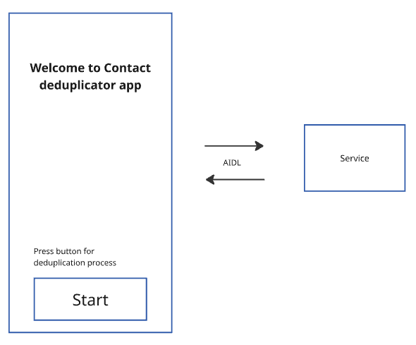
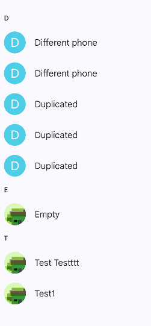
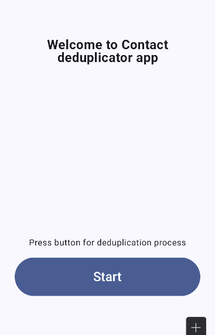
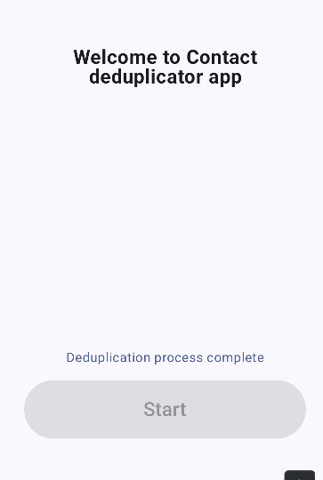
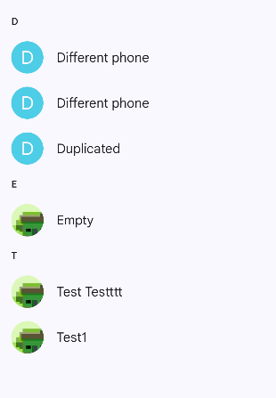
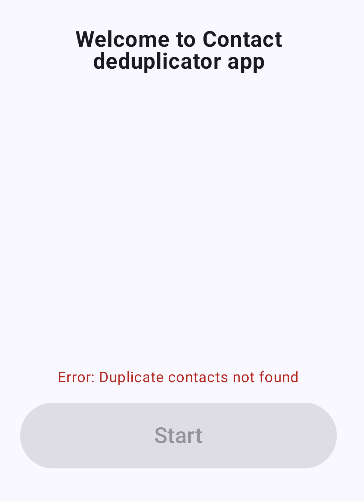

# Тестовое задание Yadro

## Вариант 2. Приложение, удаляющее повторяющиеся контакты

Выполнил: Щербинин Эдуард Павлович

### UserStory1
Я, как пользователь, хочу иметь возможность удалять повторяющиеся контакты с
устройства

### Описание:
Разработать Android приложение, которое будет иметь возможности искать и удалять
повторяющиеся контакты с устройства. Все операции с контактами должны быть
реализованы внутри отдельного сервиса, который взаимодействует с приложением через
AIDL.
После завершения операции пользователь должен быть проинформирован о статусе
операции:
- повторяющиеся контакты удалены успешно
- произошла ошибка
- повторяющиеся контакты не найдены
  Для проверки функционала можно использовать любое установленное на устройство
  приложение Контакты для создания повторяющихся контактов и проверки их удаления.

### Критерии приемки:
* Пользователь может начать процесс удаления из приложения
* Сервис находит и удаляет повторяющиеся контакты на устройстве
* Сервис сообщает приложению, что удаление дублей контактов завершено.

### Требования:
Повторяющимися контактами считаются контакты, имеющие полностью одинаково
заполненные поля. Только такие контакты должны быть удалены.

## Реализация

* Основное приложение с интерфейсом, являющееся AIDL-клиентом: [app](app)
* Приложение-сервис, реализующее логику удаления контактов, и являющееся сервером: [ContactDedupService](ContactDedupService)

### Основное приложение

* UI реализован в [DedupScreen.kt](app/src/main/java/com/edsh/contdedup/component/DedupScreen.kt) (Jetpack compose)
* Логика приложения (взаимодействия с сервисом) реализована в [DedupViewModel.kt](app/src/main/java/com/edsh/contdedup/viewmodel/DedupViewModel.kt)

Проверим на следующем наборе контактов:

Открыв основное приложение, попадаем на главную страницу:

Нажмём Start:

Дубликаты удалились (Different phone имеют разные номера):

Повторное нажатие сообщает, что повторяющиеся контакты не найдены:

Сообщение пропадает через 5 секунд

### Приложение-сервис

* Должно быть запущено перед использованием основного приложения
* AIDL-интерфейс определён в [IDedupService.aidl](ContactDedupService/src/main/aidl/com/edsh/service/IDedupService.aidl)
* Bound-сервис определён в [DedupService.kt](ContactDedupService/src/main/java/com/edsh/contdedser/DedupService.kt)
* Логика взаимодействия с контактами реализована в [ContactUtil.kt](ContactDedupService/src/main/java/com/edsh/contdedser/ContactUtil.kt)
